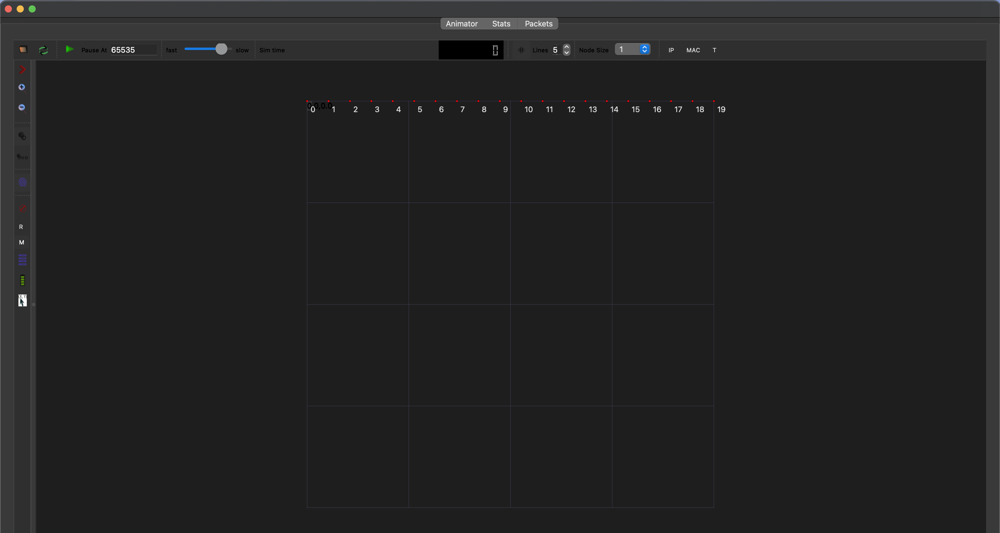
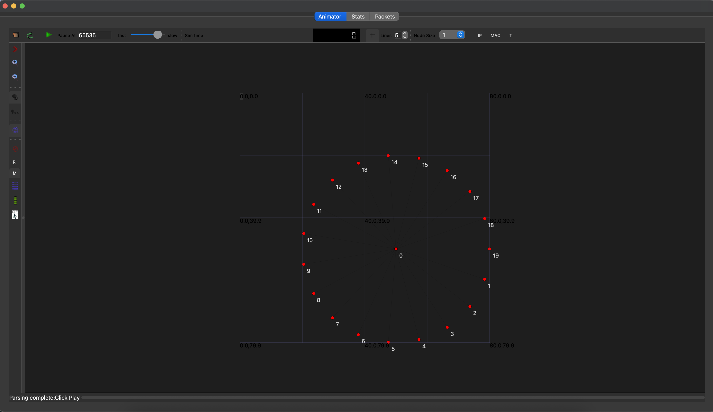
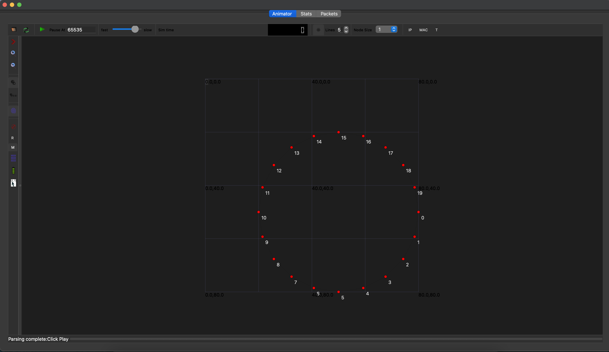
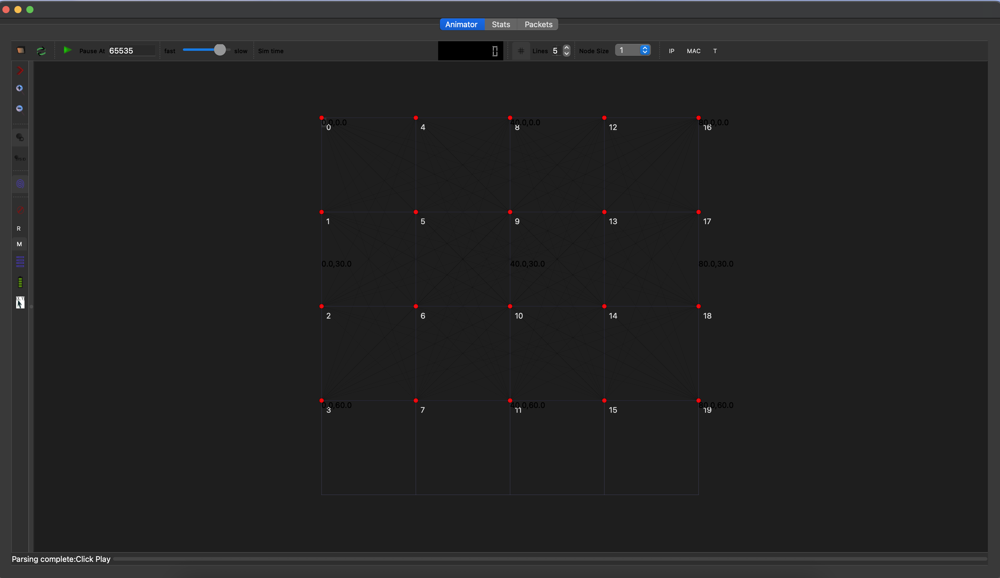
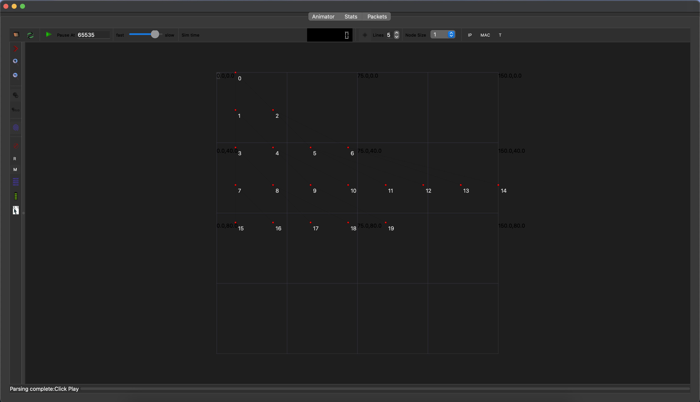

# 🌐 Network Topology Simulation using NS-3

## 📌 Overview

This project demonstrates the implementation and simulation of various network topologies using ns-3.
The goal is to analyze how different topologies behave in terms of connectivity and communication.

The following topologies are implemented:

* Line Topology
* Star Topology
* Ring Topology
* Mesh Topology
* Tree Topology

## ⚙️ Technologies Used

* C++
* ns-3 Network Simulator
* NetAnim (for visualization)

## 📁 Project Structure

```
NetworkTopologyCreation/
│
├── src/
│   ├── lineTopology.cpp
│   ├── starTopology.cpp
│   ├── ringTopology.cpp
│   ├── meshTopology.cpp
│   └── treeTopology.cpp
│
├── images/
│   ├── lineTopology.png
│   ├── starTopology.png
│   ├── ringTopology.png
│   ├── meshTopology.png
│   └── treeTopology.png
│
└── README.md
```

## ▶️ How to Run

1. Install ns-3 on your system
2. Place the files inside the ns-3 scratch folder
3. Run using:

```
./waf --run scratch/lineTopology
./waf --run scratch/starTopology
./waf --run scratch/ringTopology
./waf --run scratch/meshTopology
./waf --run scratch/treeTopology
```

## 📊 Results

### 🔹 Line Topology



### 🔹 Star Topology



### 🔹 Ring Topology



### 🔹 Mesh Topology



### 🔹 Tree Topology



## ⚠️ Limitations

* Raw output files could not be exported from the simulation environment
* Results are presented using screenshots

## 🚀 Future Improvements

* Add performance metrics (delay, throughput)
* Automate result logging
* Compare topology efficiency

## 🙌 Conclusion

This project provides a clear understanding of different network topologies and their behavior using simulation tools like ns-3.
